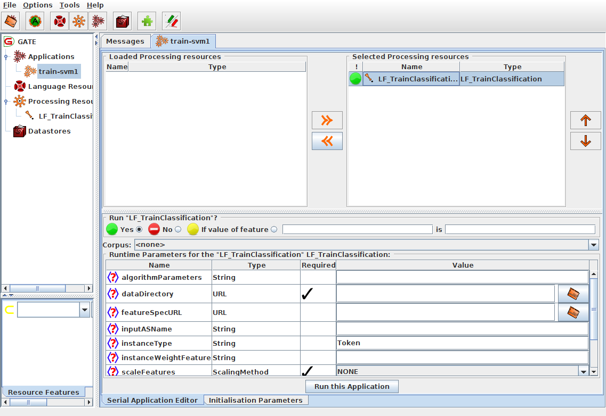

# Tutorial on Text Classification

**NOTE: this tutorial is currently under construction!!**

The aim of this tutorial is to help with the following:
* Understand what the text classification task is
* Apply different machine learning algorithms to the problem:
  Logistic Regression, Support Vector Machines
* Understand how to evaluate the quality of a learned model
* Understand how choosing the features and hyperparameters influences
  the quality of a learned model
* Apply neural network approaches to the problem
* Understand the influence of hyperparameters, network architecture and
  optimization strategy when using a neural network

## Preparation

This tutorial requires GATE version 8.5.1 or higher.

Please download and prepare the following
* !!!TODO: download the following ZIP-file [zipfile](TODO)
* extract the files to a working directory on your computer
* the directory contains the necessary documents and prepared
  pipelines for the various steps in the tutorial
* If you follow the steps in this tutorial you will create your own pipelines from scratch, but you can always use or compare with the prepared pipelines which are already there

## The Text Classification task

Whenever we have spans of text and the task is to assign one of several
possible classes to that span of text, we call that a
*text classification task*.

Some examples of this task are:
* Topic classification: each span of text should get assigned to one of several
  possible topics. A span of text for that task is often a whole document or a
  paragraph.
* Sentiment classification: each span of text, usually a sentence, should get
  assigned to one of several sentiments, often just "positive" or "negative"
* POS tagging: each word should get assigned a "Part of Speec" tag, e.g.
  "noun", "adverb" etc. For this task, the span of text is almost always
  a single word or token. This task is also special in that the sequence of
  the POS tags within a sentence follows certain rules. There is a
  separate tutorial for that task: [POS Tagging Tutorial](TutPOSTagging).
* Product reviews: for each span of text that represents a product review
  assign one of a view quality decisions ("positive" vs. "negative", or e.g.
  "0star" to "5star")

In GATE terms, what we want to accomplish is that an annotation that
covers the text (e.g. a document or a sentence) gets a feature that contains the *class label*. For example, if our task is sentiment classification of sentences, then there should be an annotation for each sentence (e.g."Sentence") and the feature map for the annotation should contain a feature where the value reflects the sentiment, e.g. a feature called "class" that can have the value "positive" or "negative".

One way to achieve this which you may already know is to create an application where we try to match words with a gazetteer and use JAPE rules to eventually assign the class label.

But if we want to use machine learning, our approach will be different: we will have to start with a corpus, that already contains a large number of texts and their corresponding class labels and we will *train* a model that will learn how to assign labels to new texts.
We will also need texts with their known labels in order to find out how well the trained model actually works.

In this tutorial we look at an example that is similar to the product review example: short movie review snippets of text and whether the review is positive or negative.

The original data for this is taken from the "sentence polarity dataset v1.0"
dataset available from the Cornell University
 [Movie Review Data](http://www.cs.cornell.edu/people/pabo/movie-review-data/)
download page. This dataset has been widely used by researchers for experimenting with
various text classification approaches.

## The dataset

The dataset contains 5331 sentences or text snippets known to represent
a positive movie review and 5331 sentences/snippets known to represent
a negative review.

We will need to use this dataset for two different purposes:
* For training a model that learns how to assign the class label
* For evaluating how well the model works

!!! IMPORTANT: evaluating a machine learning model is one of the
most important steps when doing machine learning. If this is not
done properly, we may get a wrong impression of how well our trained
model may perform on new, unseen data. To get a good estimate for
this, we need to actually use unseen data for the evaluation, so we
need to split the data we have in a part that is used for training and
in a different part that is used only for evaluation.

If we would use the training data for evaluation, we could easily
overestimate the performance of the algorithm, because an algorithm
could always just memorize what it has seen in the training data
which would give it the best possible performance on that data, but
would fail for any new data.

In this tutorial you will see that in order to train a good model,
one often has to try a number of different approaches, evaluate them
and then compare how well each approach does. When we do this very often, we start to slowly "adapt" our model to the data we have
kept aside for evaluation. We may improve our results on that
data, but the model we end up with may be too specific to the
evaluation data now and not perform so well on the actual unseen
data. For this reason, a common strategy is to actually keep aside
two different sets of evaluation data:
* development set: this is used for repeated evaluation in order to figure out which algorithms and algorithm parameters to use
* test set: this is used only once or very very rarely to get a final estimate of how well the model may perform on actual unseen data

In other words, we should divide our labelled/annotated corpus
into three portions:
* training set: used for training a model
* development set: used for evaluating models during experimentation
* test set: used for evaluating one or only a few final models which are the result of the experimentation

When we divide the original corpus, we should:
* divide the instances as randomly as possible
* but make sure that the distribution of the labels is the same in all parts

In our case there are an identical number of positive and negative sentences in the original dataset. Each sentence was converted into its own GATE document and then the whole corpus was divided into 3 corpora:
* train: 8530 sentences (4265 positive and negative each)
* dev: 1066 sentences (533 pos/neg each)
* test: 1066 sentences (533 pos/neg each)

## Inspect the prepared corpora

For this tutorial, all the sentences from the original corpus have
been converted to GATE format (one document per snippet/sentence),
randomly split into sets for train/dev/test and imported into
a serial datastore.

Open the datastore by starting GATE and choosing
`Datastore` - `Open Datastore` - `SerialDatastore` - then navigate
to the extracted directory `gate-lf-tutorial-textclassification1` and choose the subdirectory `corpus`.

Double click the `corpora` datastore then double click each of the
three corpora `dev`, `test`, and `train` under `GATE Serial Corpus` to  put them under the `Language Resources` tree in the GUI.

Double click the `train` corpus then double click a few of the documents which get displayed to inspect them and see what they look like:
* You notice all the text is lower-case. This is already in the original corpus, so we have to go along with it
* You may also notice that all the punctuation and quotes are separated by space on both sides - this is also already in the original corpus.
* click the `Annotation Sets` and `Annotation List` buttons
* There are three sets: the default set, the Key set and the "Original markups" set, only the "Key" set contains annotations, in each document, there is a single `Sentence` annotation in the Key set.
* the `Sentence` annotation in the Key annotation set covers the
entire span of the document (which is just a sentence or snipped in any case). The annotation contains features from the conversion
processin in the feature map, we can ignore those.
In addition, there is the important feature: `class` which can have
either the value `neg` or `pos`. This is what we want to learn.
* Also look at documents in the `dev` and `test` corpus, they
should contain exactly the same kind of documents and annotations.

## Create Tokens

Before we can do anything we need at least to get token annotations.
For this we will simply use ANNIE which will create the Token,
SpaceToken and other annotations for us and will already create
some features in the feature maps of the annotations as well, e.g.
the POS tag ("category") of each token.

However, the standard ANNIE pipeline also creates Sentence annotations
and we already have those in the Key set, so we have to modify the
ANNIE pipeline. To do this perform the following steps (the result of these steps is in your directory in the `prepared-annie.xgapp` pipeline):
* Load the default ANNIE pipeline (`Applications` - `Ready made applications` - `ANNIE` - `ANNIE`)
* Double click the pipeline to show the processing resources (PRs)
* Instead of running the Sentence Splitter (step 4) we want to copy the Sentence annotation from the Key set
* Click the Plugin-Manager and load the `Tools` plugin (which contains the Annotation Set Transfer PR)
* Right click on `Processing Resources` - `New` and choose `Annotation Set Transfer`
* In the ANNIE pipeline editor click on the Annotation Set Transfer PR in the left pane, then click on the ANNIE Sentence Splitter in the right pane then click the "move to right" button between the two panes (">>") to insert the Annotation Set Transfer PR
* In the `Processing Resources` view right click the `ANNIE Sentence Splitter PR` and choose "close". This removes the Sentence Splitter from the pipeline as well.
* Click on the Annotation Set Transfer PR and  change the run time parameters:
  * change `copyAnnotations` to `true`
  * set `inputASName` to Key

Now save the modified pipeline into your directory as `annie.xgapp`

Run the pipeline on a single document from one of the corpora and
check that it works as intended: there should be Token, SpaceToken and Sentence annotations in the default annotation set now.
Run the pipeline again on the same document: the same annotations should be there and annotations should not accumulate -- everything gets reset correctly!

When everything works fine, run the pipeline on all three corpora (train, dev, test).

After this, all three corpora have now Sentence, Token, SpaceToken
and a few additional annotations from ANNIE. We will need this
as the starting point for our machine learning approaches, so
it is a good idea to backup the "corpora" directory to a zip file
at this point to make it easy to restore it later if we accidently damage the datastore or corpora in any way.

NOTE: ANNIE is meant to run on "proper" text with proper case and punctuation. This corpus is all-lower-case and has punctuation and quotes surrounded by spaces, so what ANNIE creates (e.g. the POS tags) may not be as accurate as it could be for proper text. For this tutorial we will just accept that.

## Train and evaluate a LibSVM model

### Training

Let us create a pipeline for performing our first training of a model.
We will create two pipelines:
* A training pipeline, `train-svm1.xgapp` which will train a model
  from just the strings of all the tokens using the LibSVM algorithm
* An application/evaluation, `apply-svm1.xgapp` pipeline which will apply the model and
  evaluate how well it works.

To create the training pipeline perform the following steps:
* Start GATE and make sure nothing is loaded from a previous session
  (if you start GATE from the command line, use the -tmp parameter)
* Open the datastore "corpora" and load the "train" corpus
* Create an empty pipeline by right-clicking `Applications`, then selecting `Create new application` - `Conditional Corpus Pipeline`
* Open the plugin manager (`File` - `Manage Creole Plugins`)
* Scroll down the list of plugins and find the "LearningFramework".
* Put a check mark in the first of the two boxes ("Load now")  
* Click the "Apply All" button, then close the dialog
* Create PR `LF_TrainClassification` from the `Processing Rsources` menu
* Edit the pipeline and add the `LF_TrainClassification` PR to the selected processing resources list by clicking the `>>` button.
* Select the PR to show its runtime parameters. Your GATE GUI should now look similar to the following:

Let us have a look at all the Runtime Parameters for this PR and
enter/change those which are needed:
* `algorithmParameters`: this can be used to control the behaviour of whichever learning algorithm we use, but for now we are fine with the default behaviour and leave this empty
* `dataDirectory`: this should be a directory which will contain the trained model and additional information that will be needed later when applying the model. This should be a new empty directory for every kind of model we create.
Click the button at the end of the entry field (you may need to scroll to the right) to bring up the file chooser and use the "Create new folder" button to create a new directory "model-svm1"
* `featureSpecURL`: this should point to a file in XML format, the
[Feature Specification File](/FeatureSpecification), which describes the features/attributes we want to use for learning. In our first attempt we only want to use the string for each Token annotation which is the default, so we can leave this empty for now.
* `inputASName`: the input annotation set, leave empty for the default annotation set
* `instanceType`: the annotation type of the "instances", in other words the things for which we want to learn to assign a class. In our case these are the sentences, identified by the "Sentence" annotation type which is already the
default for this parameter.
* `instanceWeightFeature`: ignore this for now
* `scaleFeatures`: ignore this for now
* `sequenceSpan`: ignore this for now
* `targetFeature`: this is the name of the feature on each "instance" annotation (i.e. on each annotation of type "Sentence") which identifies the class of the instance, in our case this is "class"
* `trainingAlgorithm`: here you can choose the machine learning algorithm from
a menu, choose `LibSVM_CL_MR` for now. All the algorithms and their parameters are documented
on the [LF_TrainClassification](/LF_TrainClassification) documentation page.
* Rename the pipeline to "train-svm1"
* Save the pipeline as `train-svm1.xgapp`
* After this you should have a new directory `model-svm1` and a new pipeline file `train-svm1.xgapp` in the tutorial directory
* This pipeline should now be identical to the prepared pipeline
  `prepared-train-svm1.xgapp` in the directory
* Make sure the corpus "train" is selected in the pipeline editor
* Click the "Messages" tab then right-click the "train-svm1" pipeline and choose `Run this Application` to run the pipeline.

This will first process the 8530 documents to create all the necessary input for the algorithm and then start the actual training. During training some information is written to the message pane from the LibSVM algorithm: this shows how the algorithm tries to optimize the numerical model. After a little while the optimization will have finished and you will see information about the engine class, algorithm, the number of training instances and more in the log. The value shown for "Info.classLabels" shows the class labels encountered in the training set, here these are the values "neg" and "pos".
The value shown for "Info.nrTrainingDimensions" indicates the actual number of features generated from the training documents for the algorithms. Since we use the Token strings, this is the number of unique different strings encountered in the training set.

This also shows the date and time training of the model finished as "Info.modelWhenTrained" which is useful to make sure the correct model is used at application time (where this will also get shown)

Finally the features/attributes used for learning are shown at the end, in this case it is the single line "NgramAttribute{name=,type=Token,feature=string,featureName4Value=,number=1}"
which indicates that we use n-grams with number=1, so unigrams, where the value of each unigram comes from the "string" feature of annotations of type "Token".

The trained model and additional information has now been saved into the
`mode-svm1` directory. If you look at the contents of the directory you should find the following files:
* `featureinfo.ser`: this is used to remember which attributes/features are used
* `info.yaml`: information about the learning task in yaml format. This is a human-readable format
* `lf.model`: the actual model created by the LibSVM algorithm
* `pipe.pipe`: information about the representation of instances

### Application/Evaluation

Now let us create a pipeline for evaluating our model.

* Start GATE and make sure nothing is loaded from a previous session
  (if you start GATE from the command line, use the -tmp parameter)
* Open the datastore "corpora" and load the "train" and "dev" corpora
* Create an empty pipeline by right-clicking `Applications`, then selecting `Create new application` - `Conditional Corpus Pipeline`
* Rename the pipeline to "apply-svm1"
* Open the plugin manager (`File` - `Manage Creole Plugins`)
* Scroll down the list of plugins and find the `LearningFramework`
* Put a check mark in the first of the two boxes ("Load now")  
* Locate the `ANNIE` plugin and also click the "Load now" check box
* Locate the `Evaluation` plugin and click the "Load now" check box
* Click the "Apply All" button, then close the dialog
* Create PR `Document Reset` from the `Processing Resources` menu
* Create PR `LF_ApplyClassification` from the `Processing Rsources` menu
* Create PR `EvaluateTagging`
* Edit the pipeline and add first the `Processing Resources`, then the
  `LF_ApplyClassification` PR and finally the `EvaluateTagging` PR
* Select the `LF_ApplyClassification` PR to show its runtime parameters.
  * choose `model-svm1` as the dataDirectory
  * leave "outputASName" set to "LearningFramework". This will create new instance annotations, i.e. annotations of type "Sentence" in a set called "LearningFramework"
* Select the `Document Reset` PR and
  * set `setsToRemove` to "LearningFramework"
* Select the `EvaluateTagging` PR and set the following parameters:
  * `addDocumentFeatures`: set to "false"
  * `annotationTypes`: set to "Sentence"
  * `featureNames`: set to "class"
  * `keyASName`: should be set to "Key"
  * `responseASName`: should be set to "LearningFramework"
* Save the pipeline as `apply-svm1.xgapp`
* The pipeline should now be identical to the prepared version of this pipeline with the name `prepared-apply-svm1.xgapp`

Set the corpus to "train" and run the pipeline. After a short while the output of the EvaluateTagging PR should get shown in the Messages tab. The
value that is of interest here is "Accuracy Strict". This will show a value
of "0.5374". This means that 53.74 percent of the instances have been
assigned the correct class by the model.

We know that exactly 50 percent of the instances have class "neg" and the other 50 percent have class "pos" so we could have achieved 50 accuracy by
just always guessing one of the two. So 53.74 is only slightly better than
this simple approach: our model performs very poorly on the training set even
though it is the exact same data it already has seen during training!

In order to get a better estimate of the model's performance on unseen data,
re-run the pipeline on "dev" corpus. This will show an accuracy of "0.5244".
Unsurprisingly this is even worse than what we have got on the training set, since this is now data that has not been seen during training.

Maybe we can improve the quality of the model by changing some of the parameters for the algorithm.

### Experiment with the LibSVM Parameters

When we look at the documentation of the LibSVM algorithm on
the [LF_TrainClassification documentation page](/LF_TrainClassification),
we see that we can specify the parameters for LibSVM as documented
on the page [https://www.csie.ntu.edu.tw/~cjlin/libsvm/](https://www.csie.ntu.edu.tw/~cjlin/libsvm/). If we scroll down a bit on that page,
we get a short overview of the possible options.
A detailed description of the algorithm can be found in
[Chang and Lin, 2001: "LIBSVM: A library for Support Vector Machines"](https://www.csie.ntu.edu.tw/~cjlin/papers/libsvm.pdf)

What is important for us is that the LibSVM algorithm can use very different ways for how to represent a model, by using different "kernel types". The default type is type 2, "radial basis functions". Let us try and see what happens if we use "linear" instead which is selected by using the option
"-t 0".

In order to train a model with a linear kernel, load the `train-svm1.xgapp` pipeline again, and set the run time parameter "algorithmParameters" of the `LF_TrainClassification` PR to "-t 0". Then run the training again on the "train" corpus. This will create a new model and save it in the "model-svm1" directory, replacing the model that was there from our first attempt.

Once training has finished, load the `apply-svm1.xgapp` pipeline again and run it, first on the "train" corpus. This will now show an accuracy of 0.9937
so on the training set, almost everything is classified correctly!

Now run the `apply-svm1.xgapp` pipeline on the "dev" corpus. This shows an
accuracy 0.7617.

We can see that the algorithm has adapted very closely to the training set
but on unseen data, the performance is much worse (though a lot better than our first model did).

When an algorithm fits the training set very well but does not *generalize* very well to unseen data, this is called "overfitting". Many algorithms have
some way to control the extent to which they "overfit" the training data.

-c 1.0, dev: 0.7617, train: 0.9937

-c 0.1, dev: 0.7608, train: 0.9224

-c 2.0, dev: 0.7477 , train: 0.9966

-c 0.8, dev: 0.7645, train: 0.9912

-c 0.5, dev: 0.7617, train: 0.9828

C parameter: SVM tries to separate all the pos and neg classes by a margin as big as possible. the c parameter influences how much it tries to avoid getting wrong classes across the separating hyperplane, when c is big it will try to avoid that as much as possible while with c being small it will allow it

Using -t 0 and -c 0.8:

feats-stringpos: dev: 0.7617 train: 0.9906
feats-string1g2g: dev: 0.7842, train: 1.0, dim=111300
feats-stringtfidf: dev: 0.7083, train: 1.0

// using mindf=5 and maxrdf=0.5 and setting ngram1 to tfidf and 2 to 1.0:
feats-string1g2g-min5: dev: 0.7158 train: 0.9986, dim=49121

// same but setting ngram1 to 1.0 as well:
feats-string1g2g-min5: dev:

For debugging the duplication bug:
Maxent default: dims=17972, dev=0.772
Batch gives: dims=17972, dev=0.7749

Maxent GCP t=1: docs=8530, dims=17972, dev=0.772
Maxent GCP t=2: docs=8530, dims=17972, dev=0.7786
Maxent GCP t=5: docs=8530, dims=17972, dev=0.7749

So per number of threads, the results are repeatable but there are
differences for different numbers of threads

C45 GUI:

1) MaxEnt, just string.

2) MaxEnt, try POS, does not help

3) explain tfidf, create tfidf features, try with MaxEnt

4) try svm, default

5) try svm, linear

6) try svm, linear with tfidf features

!!TODO: SVM with string and pos?
